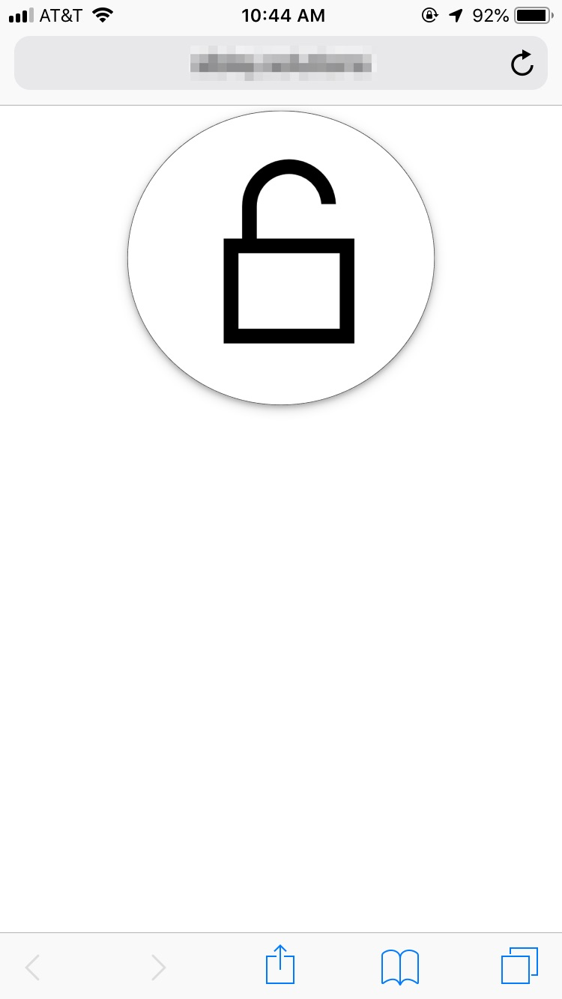

# IoT Apartment Entry

### Description
This repository contains components for turning an ESP32 board into a remote apartment entry system, for when I don't have my keys with me.

### Hardware
The [ESP32](https://www.adafruit.com/product/3269) is connected to two [push-pull solenoids](https://www.adafruit.com/product/413) which press the necessary buttons on the intercom in succession to unlock the front gates of the building upon request from a user interface.

Components are mounted on a 3D printed module, designed in OnShape, which attaches to the front of the intercom. The STL for the mount is in the `stl` directory.

### Software
The software on the board is implemented in MicroPython. The API is made available through AWS API Gateway, and activated through AWS Lambda. S3 is used to store the state of the lock in a simple JSON file. DynamoDB can be used to support more connected devices.

User's request to unlock the door is handled by `request_unlock_lambda.py`. The server on the ESP32 board polls the API (`poll.py`), handled by `handle_unlock_ping_lambda.py`. If the API returns that the door should be unlocked, poller initiates the button presses via the solenoids.

### Retrospective
This system was hacked together quickly to provide an immediate solution. Polling can be eliminated by having the API trigger the ESP32 board instead to reduce network load.

## Images

Top View                     |  Sideview                       | Simple GUI
:---------------------------:|:--------------------------:|:-----------------------------:
  |   | 

